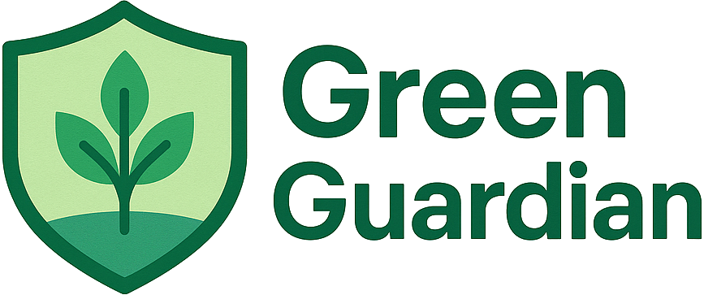

# 🌍 Green Guardian: Empowering Environmental Action



> *"Be the guardian our planet needs"*

## 🌟 Inspiration
In a world where environmental issues often go unreported, Green Guardian empowers citizens to become active protectors of our planet. Born during a 24-hour hackathon, this project aims to bridge the gap between environmental awareness and action.

## 🚀 What it does
Green Guardian is a revolutionary web platform that transforms everyday citizens into environmental defenders. With just a few clicks, users can:

🎯 **Report Environmental Issues**
- Instantly document pollution, illegal dumping, or environmental hazards
- Upload images with geolocation for precise tracking
- Add detailed descriptions and severity levels

🗺️ **Interactive Map Visualization**
- Real-time mapping of environmental reports
- Heat maps showing problem hotspots
- Filter issues by type and severity

📱 **Seamless Mobile Experience**
- Fully responsive design for on-the-go reporting
- Modern, dark theme UI that's easy on the eyes
- Lightning-fast performance with Vite

## 🛠️ How we built it

### Tech Stack Highlights:
- ⚡ **React + Vite** - For blazing-fast performance
- 🎨 **Tailwind CSS** - Beautiful, responsive design
- 🔥 **Firebase** - Real-time data and image storage
- 🌎 **OpenStreetMap** - Interactive mapping
- 📱 **Mobile-First** - Responsive on all devices
## 🎯 Challenges we ran into
- Implementing real-time updates while maintaining performance
- Creating a smooth mobile experience for image uploads
- Optimizing map rendering with large datasets
- Balancing feature richness with simplicity

## 🏆 Accomplishments
- Built a fully functional environmental reporting system in 24 hours
- Created an intuitive UI that anyone can use
- Implemented real-time data synchronization
- Achieved seamless mobile responsiveness

## 🎓 What we learned
- Advanced Firebase integration techniques
- Real-time geospatial data visualization
- Progressive Web App optimization
- Mobile-first design principles

## 🔮 What's next
- Community features for coordinated cleanup efforts
- AI-powered issue classification
- Integration with local environmental agencies
- Gamification elements to encourage participation

## 🚀 Quick Start

1. Clone the repository:
```bash
git clone https://github.com/Angelel02/green-guardian.git
cd green-guardian
```

2. Install dependencies:
```bash
npm install
```

3. Set up environment variables:
- Copy `.env.example` to `.env`
- Fill in your Firebase credentials

4. Start the development server:
```bash
npm run dev
```

## 🌟 Demo
Check out our live demo: [Green Guardian Demo](https://green-guardian-env.vercel.app)

## 👥 Team
- [Angelos Eleftheriou](https://github.com/Angelel02) - Full Stack Developer

---
*Built with 💚 for the planet*
